# 🛡️ Kill Addiction - Upgrade Roadmap Plan (V2.1.0 ➔ V3.0.0)

**Dự án:** Kill Addiction - Feed Blocker & DOM Inspector Extension  
**Tác giả:** Nguyễn Thịnh - Kyle  
**Mục tiêu:** Nâng cấp hệ thống quản lý thời gian, hoàn thiện UI 3 Tabs Dashboard (Thống Kê Thời Gian, Hiệu Suất, Cấu Hình), bổ sung Chế Độ Tập Trung Cao Độ, Giới Hạn Giờ Dùng và Đồ Thị Tương Tác Canvas Theo Từng Phần Tử.

---

## 📌 PHƯƠNG HƯỚNG PHÁT TRIỂN & CẤU TRÚC 3 TABS DASHBOARD

```mermaid
graph TD
    A["🛡️ Kill Addiction Dashboard (3 Tabs)"] --> T1["Tab 1: 📊 Thống Kê Thời Gian"]
    A --> T2["Tab 2: ⚡ Hiệu Suất (Phân Tích Chuyên Sâu)"]
    A --> T3["Tab 3: ⚙️ Cấu Hình (Hợp Nhất)"]

    T1 --> T1_1["📅 Weekly Trend Line Chart (Canvas Hover Point Glow + Tooltip)"]
    T1 --> T1_2["📈 Top 5 Webs Bar Chart (Canvas Hover Bar Glow + Tooltip)"]
    T1 --> T1_3["🍩 Donut Chart (Canvas Hover Slice Pop-out Glow + Tooltip)"]

    T2 --> T2_1["🎛️ Bộ Lọc Thời Gian (Hôm nay / Tuần này / Tháng này)"]
    T2 --> T2_2["🏆 Điểm Tập Trung Productivity Score (0-100)"]
    T2 --> T2_3["⚠️ Distraction Index (Tỷ lệ xao nhãng)"]
    T2 --> T2_4["🔥 Focus Streak (Chuỗi ngày giữ vững phong độ)"]
    T2 --> T2_5["⚡ Dopamine Detox Saved Time (Thời gian tiết kiệm)"]
    T2 --> T2_6["🔥 24-Hour Hourly Usage Heatmap"]

    T3 --> T3_1["⚙️ Bật/Tắt Feed MXH Mặc Định"]
    T3 --> T3_2["🚫 Chặn Hẳn 100% Custom Domain & Subdomain"]
    T3 --> T3_3["⏱️ Giới Hạn Thời Gian Dùng Trong Ngày (Daily Time Quota)"]
    T3 --> T3_4["🔒 Chế Độ Tập Trung Cao Độ (Strict Focus / Pomodoro Mode)"]
    T3 --> T3_5["📅 Khung Giờ Làm Việc Tự Động (Work Hours Schedule)"]
    T3 --> T3_6["🎯 Bộ Chọn CSS Đã Ẩn Thủ Công (Zapped Elements)"]
```

---

## 🚀 CHI TIẾT CÁC PHÂN ĐOẠN PHÁT TRIỂN

### 🎯 PHASE 1: CẤU HÌNH TẬP TRUNG & MÔ-ĐUN QUẢN LÝ (Bản V2.1.0)

1. **⚙️ Tab 3: Cấu Hình Hợp Nhất (Unified Config UI):**
   * Đã tích hợp đầy đủ giao diện người dùng vào Tab Cấu Hình:
     * **⏱️ Daily Time Quota**: Cho phép thêm/xóa hạn mức phút/ngày cho từng domain.
     * **🔒 Strict Focus Mode**: Cho phép chọn 25m/45m/60m và kích hoạt khóa các nút toggle tạm thời.
     * **📅 Work Hours Schedule**: Cấu hình khung giờ tự động kích hoạt chặn feed (vd: 08:00 - 17:00).
     * **🎯 Zapped Elements**: Quản lý và giải phóng các phần tử DOM đã click ẩn thủ công.

2. **🎨 Tương Tác Canvas Phát Sáng Theo Từng Phần Tử (Per-Element Hover Glow):**
   * Loại bỏ viền ngoài card container khi hover.
   * Chỉ tập trung phát sáng và nhô nổi (`Pop-out & Glow`) trực tiếp vào **đúng phần tử đang di chuột** (Cột web trong Bar chart, Miếng bánh trong Donut chart, Điểm ngày trong Trend line chart) cùng Tooltip nổi thông tin chi tiết.

---

### ⚡ PHASE 2: PHÂN TÍCH HIỆU SUẤT & CHỈ SỐ MỚI (Bản V2.2.0)

1. **⚡ Tab 2: Hiệu Suất (Performance Insights Dashboard):**
   * Đã bổ sung các bộ lọc thời gian: **`Hôm nay`**, **`Tuần này`**, **`Tháng này`**.
   * Đưa vào 2 chỉ số độc đáo mới:
     * **🔥 Focus Streak (Chuỗi Ngày Tập Trung)**: Số ngày liên tiếp duy trì tỷ lệ xao nhãng dưới mức cảnh báo.
     * **⚡ Dopamine Detox Saved Time**: Tổng số giờ thời gian tiết kiệm được từ việc ngăn chặn lướt feed vô thức.
   * **🔥 24-Hour Hourly Usage Heatmap**: Đồ thị nhiệt 24 cột giờ giúp nhận diện khung giờ lướt web cao điểm.

---

### ☁️ PHASE 3: MULTI-DEVICE SYNC & PERFORMANCE (Bản V3.0.0)

1. **☁️ Đồng Bộ Hóa Đa Thiết Bị (`chrome.storage.sync`):**
   * Đồng bộ tự động quy tắc chặn và Quota trên mọi thiết bị Chrome.

2. **⚡ Tối Ưu Hóa Idle Alarm Background Engine:**
   * Tiết kiệm CPU & Pin tối đa bằng Chrome Alarms API khi trình duyệt nghỉ.

---

## 🛠️ TIẾN TRÌNH THỰC HIỆN

| Hạng mục | Mức độ ưu tiên | Trạng thái |
| :--- | :--- | :--- |
| **Fix Canvas Hover Glow Trực Tiếp Vào Cột / Miếng Bánh / Point** | 🔴 Cao | ⚡ Complete |
| **Giao Diện UI Quota, Strict Focus & Work Schedule Trong Tab Cấu Hình** | 🔴 Cao | ⚡ Complete |
| **Tab Hiệu Suất Mới: Bộ Lọc Hôm nay/Tuần/Tháng + Focus Streak & Detox Time** | 🔴 Cao | ⚡ Complete |
| **Chrome Storage Sync & Alarm Idle Optimization** | 🟢 Thấp | 📋 In Plan |
