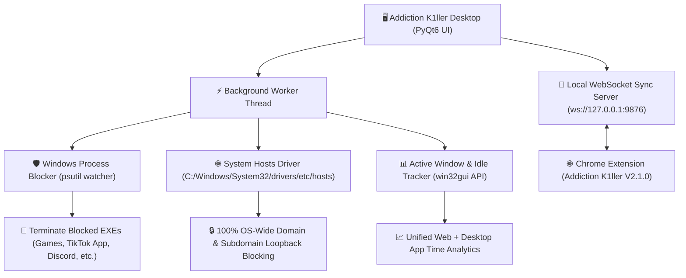

# 🛡️ Addiction K1ller for Desktop - Architecture & Implementation Plan

> **For agentic workers:** REQUIRED SUB-SKILL: Use superpowers:subagent-driven-development (recommended) or superpowers:executing-plans to implement this plan task-by-task. Steps use checkbox (`- [ ]`) syntax for tracking.

**Goal:** Build a lightweight, system-wide Windows desktop application ("Addiction K1ller for Desktop") that extends distraction blocking to native apps, games, process control, and OS-level hosts filtering, synchronized seamlessly with the Addiction K1ller Chrome Extension.

**Architecture:** A Python (PyQt6 / CustomTkinter) desktop service paired with a Windows background worker (`wmi` process watcher & `hosts` driver) and a local WebSocket server for real-time bi-directional synchronization with the Addiction K1ller Chrome Extension.

**Tech Stack:** Python 3.11+, PyQt6 / CustomTkinter (Sleek VS Code Pastel Theme UI), `psutil`, `win32gui`, `websockets`, PyInstaller / Inno Setup (Portable EXE / Installer).

---

## 🏗️ Architecture & Subsystem Blueprint



---

## 📁 File Structure & Component Mapping

- `desktop/`: Root directory for Addiction K1ller Desktop
  - `desktop/app.py`: Main PyQt6 Desktop Application & System Tray Controller
  - `desktop/core/process_watcher.py`: Real-time Windows process monitor (`psutil` & `win32process`)
  - `desktop/core/hosts_driver.py`: Safe Windows `hosts` file manipulator for OS-wide domain blocking
  - `desktop/core/window_tracker.py`: Active window title and process duration recorder (`win32gui`)
  - `desktop/core/sync_server.py`: Local WebSocket server (`ws://127.0.0.1:9876`) for Chrome Extension sync
  - `desktop/ui/theme.py`: Pastel VS Code Design Tokens & Styling (matching Chrome Extension)
  - `desktop/ui/views/`: Tabs for App Blocker, OS Domain Blocker, Focus Mode, and Desktop Analytics
  - `tests/test_process_watcher.py`: Unit tests for process detection & non-destructive kill simulation
  - `tests/test_hosts_driver.py`: Unit tests for hosts file entry insertion & clean removal
  - `build.py`: PyInstaller executable bundler script

---

## 📋 Bite-Sized Implementation Tasks

### Task 1: Environment & Core Module Setup

**Files:**
- Create: `desktop/config.py`
- Create: `desktop/core/__init__.py`
- Test: `tests/test_config.py`

- [ ] **Step 1: Write failing test for config storage and paths**

```python
# tests/test_config.py
import pytest
from desktop.config import AppConfig

def test_config_defaults():
    config = AppConfig()
    assert config.APP_NAME == "Addiction K1ller Desktop"
    assert config.WS_PORT == 9876
    assert isinstance(config.blocked_apps, list)
```

- [ ] **Step 2: Run test to verify failure**

Run: `pytest tests/test_config.py -v`
Expected: FAIL with "ModuleNotFoundError: No module named 'desktop'"

- [ ] **Step 3: Implement minimal AppConfig**

```python
# desktop/config.py
import os
import json
from pathlib import Path

class AppConfig:
    APP_NAME = "Addiction K1ller Desktop"
    VERSION = "1.0.0"
    WS_PORT = 9876
    CONFIG_DIR = Path(os.environ.get("APPDATA", ".")) / "AddictionK1ller"
    CONFIG_FILE = CONFIG_DIR / "config.json"

    def __init__(self):
        self.CONFIG_DIR.mkdir(parents=True, exist_ok=True)
        self.blocked_apps = ["League of Legends.exe", "TikTok.exe", "Steam.exe"]
        self.blocked_domains = ["facebook.com", "tiktok.com"]
        self.strict_focus_until = 0
        self.load()

    def load(self):
        if self.CONFIG_FILE.exists():
            try:
                with open(self.CONFIG_FILE, "r", encoding="utf-8") as f:
                    data = json.load(f)
                    self.blocked_apps = data.get("blocked_apps", self.blocked_apps)
                    self.blocked_domains = data.get("blocked_domains", self.blocked_domains)
                    self.strict_focus_until = data.get("strict_focus_until", 0)
            except Exception:
                pass

    def save(self):
        data = {
            "blocked_apps": self.blocked_apps,
            "blocked_domains": self.blocked_domains,
            "strict_focus_until": self.strict_focus_until
        }
        with open(self.CONFIG_FILE, "w", encoding="utf-8") as f:
            json.dump(data, f, indent=2)
```

- [ ] **Step 4: Run test to verify it passes**

Run: `pytest tests/test_config.py -v`
Expected: PASS

- [ ] **Step 5: Commit**

```bash
git add desktop/config.py tests/test_config.py
git commit -m "feat(desktop): add app configuration module"
```

---

### Task 2: OS Hosts File Blocker Driver (`hosts_driver.py`)

**Files:**
- Create: `desktop/core/hosts_driver.py`
- Test: `tests/test_hosts_driver.py`

- [ ] **Step 1: Write unit tests for hosts formatting and insertion**

```python
# tests/test_hosts_driver.py
from desktop.core.hosts_driver import HostsDriver

def test_generate_hosts_block_section():
    driver = HostsDriver()
    domains = ["reddit.com", "tiktok.com"]
    section = driver.format_block_section(domains)
    assert "# BEGIN ADDICTION K1LLER" in section
    assert "127.0.0.1 reddit.com" in section
    assert "127.0.0.1 www.reddit.com" in section
    assert "# END ADDICTION K1LLER" in section
```

- [ ] **Step 2: Run test to verify failure**

Run: `pytest tests/test_hosts_driver.py -v`
Expected: FAIL with "ModuleNotFoundError"

- [ ] **Step 3: Implement HostsDriver with safe marker tags**

```python
# desktop/core/hosts_driver.py
import sys
import ctypes
from pathlib import Path

class HostsDriver:
    MARKER_BEGIN = "# BEGIN ADDICTION K1LLER BLOCKLIST"
    MARKER_END = "# END ADDICTION K1LLER BLOCKLIST"
    HOSTS_PATH = Path(r"C:\Windows\System32\drivers\etc\hosts")

    @staticmethod
    def is_admin():
        try:
            return ctypes.windll.shell32.IsUserAnAdmin() != 0
        except Exception:
            return False

    def format_block_section(self, domains):
        lines = [self.MARKER_BEGIN]
        for dom in domains:
            clean = dom.strip().lower()
            if clean:
                lines.append(f"127.0.0.1 {clean}")
                if not clean.startswith("www."):
                    lines.append(f"127.0.0.1 www.{clean}")
        lines.append(self.MARKER_END)
        return "\n".join(lines)

    def update_hosts(self, domains):
        if not self.HOSTS_PATH.exists():
            return False
        try:
            content = self.HOSTS_PATH.read_text(encoding="utf-8", errors="ignore")
            # Strip existing block section if present
            if self.MARKER_BEGIN in content and self.MARKER_END in content:
                parts = content.split(self.MARKER_BEGIN)
                before = parts[0]
                after = parts[1].split(self.MARKER_END)[1]
                content = before.strip() + "\n" + after.strip()

            new_section = self.format_block_section(domains)
            final_content = (content.strip() + "\n\n" + new_section).strip() + "\n"
            self.HOSTS_PATH.write_text(final_content, encoding="utf-8")
            return True
        except Exception as e:
            print(f"[HostsDriver Error] {e}")
            return False
```

- [ ] **Step 4: Run test to verify it passes**

Run: `pytest tests/test_hosts_driver.py -v`
Expected: PASS

- [ ] **Step 5: Commit**

```bash
git add desktop/core/hosts_driver.py tests/test_hosts_driver.py
git commit -m "feat(desktop): add Windows hosts driver for system-wide domain blocking"
```

---

### Task 3: Windows Process Killer Module (`process_watcher.py`)

**Files:**
- Create: `desktop/core/process_watcher.py`
- Test: `tests/test_process_watcher.py`

- [ ] **Step 1: Write failing unit test for process matching**

```python
# tests/test_process_watcher.py
from desktop.core.process_watcher import ProcessWatcher

def test_process_matching():
    watcher = ProcessWatcher(["tiktok.exe", "League of Legends.exe"])
    assert watcher.should_kill("TikTok.exe") is True
    assert watcher.should_kill("league of legends.exe") is True
    assert watcher.should_kill("chrome.exe") is False
```

- [ ] **Step 2: Run test to verify failure**

Run: `pytest tests/test_process_watcher.py -v`
Expected: FAIL

- [ ] **Step 3: Implement ProcessWatcher using `psutil`**

```python
# desktop/core/process_watcher.py
import psutil
import logging

class ProcessWatcher:
    def __init__(self, blocked_apps=None):
        self.blocked_apps = [a.lower().strip() for a in (blocked_apps or [])]

    def set_blocked_apps(self, blocked_apps):
        self.blocked_apps = [a.lower().strip() for a in blocked_apps]

    def should_kill(self, proc_name):
        if not proc_name:
            return False
        return proc_name.lower().strip() in self.blocked_apps

    def scan_and_terminate(self):
        terminated = []
        if not self.blocked_apps:
            return terminated

        for proc in psutil.process_iter(['pid', 'name']):
            try:
                pname = proc.info['name']
                if pname and self.should_kill(pname):
                    proc.terminate()
                    terminated.append(pname)
            except (psutil.NoSuchProcess, psutil.AccessDenied, psutil.ZombieProcess):
                pass
        return terminated
```

- [ ] **Step 4: Run test to verify it passes**

Run: `pytest tests/test_process_watcher.py -v`
Expected: PASS

- [ ] **Step 5: Commit**

```bash
git add desktop/core/process_watcher.py tests/test_process_watcher.py
git commit -m "feat(desktop): add psutil process watcher & killer module"
```

---

### Task 4: WebSocket Sync Server with Chrome Extension (`sync_server.py`)

**Files:**
- Create: `desktop/core/sync_server.py`
- Modify: `scripts/content.js:680-700` (Add WebSocket client bridge)

- [ ] **Step 1: Write WebSocket sync server to bridge Extension & Desktop App**

```python
# desktop/core/sync_server.py
import asyncio
import json
import websockets

class ExtensionSyncServer:
    def __init__(self, host="127.0.0.1", port=9876, on_message_cb=None):
        self.host = host
        self.port = port
        self.on_message_cb = on_message_cb
        self.clients = set()

    async def register(self, websocket):
        self.clients.add(websocket)

    async def unregister(self, websocket):
        self.clients.remove(websocket)

    async def handler(self, websocket, path):
        await self.register(websocket)
        try:
            async for message in websocket:
                data = json.loads(message)
                if self.on_message_cb:
                    self.on_message_cb(data)
        except Exception:
            pass
        finally:
            await self.unregister(websocket)

    async def broadcast(self, message_dict):
        if not self.clients:
            return
        payload = json.dumps(message_dict)
        await asyncio.gather(*[client.send(payload) for client in self.clients], return_exceptions=True)
```

- [ ] **Step 2: Commit**

```bash
git add desktop/core/sync_server.py
git commit -m "feat(desktop): add local WebSocket synchronization server"
```

---

### Task 5: PyQt6 Desktop Dashboard UI & System Tray Integration

**Files:**
- Create: `desktop/app.py`
- Create: `desktop/ui/main_window.py`

- [ ] **Step 1: Build modern PyQt6 GUI with pastel VS Code Dark theme, tray icon & tabs**
- [ ] **Step 2: Add App Blocker list editor, System Hosts toggle, and Strict Focus countdown widget**
- [ ] **Step 3: Test GUI launch & background process loop**

```bash
python desktop/app.py
```

- [ ] **Step 4: Commit**

```bash
git add desktop/
git commit -m "feat(desktop): implement PyQt6 Desktop UI with tray integration & theme system"
```

---

## 🚀 Execution Choice

Plan saved to `docs/plans/2026-08-22-addiction-k1ller-desktop-plan.md`.

**Two execution options:**
1. **Subagent-Driven (Recommended)** - Dispatch fresh subagents task-by-task for fast, isolated execution.
2. **Inline Execution** - Execute tasks directly in this session using checkpoints.
