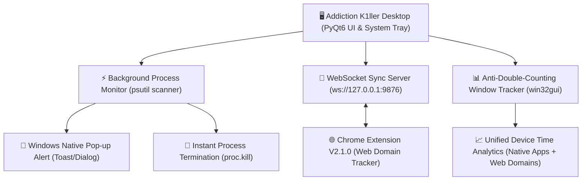

# 🛡️ Addiction K1ller for Desktop - Architecture & Implementation Plan

> **For agentic workers:** REQUIRED SUB-SKILL: Use superpowers:subagent-driven-development (recommended) or superpowers:executing-plans to implement this plan task-by-task. Steps use checkbox (`- [ ]`) syntax for tracking.

**Goal:** Build a lightweight Windows desktop application ("Addiction K1ller Desktop") focused on user-defined native application blocking with instant Windows pop-up warnings + process termination, paired with a anti-double-counting unified device time tracker synchronized with the Chrome Extension.

**Architecture:** A Python (PyQt6) system-tray application featuring a dynamic `psutil` process scanner, native Windows Toast/Pop-up notification driver, non-double-counting window time tracker, and a local WebSocket server for Chrome Extension synchronization.

**Tech Stack:** Python 3.11+, PyQt6 (Sleek VS Code Pastel Theme UI), `psutil`, `win32gui`, `win10toast` / `plyer`, `websockets`, PyInstaller.

---

## 🏗️ Core Principles & Architecture

### 1. Dynamic User-Defined App Blocking
- Zero hardcoded app lists. Users add custom executable names (e.g., `League of Legends.exe`, `GenshinImpact.exe`, `Steam.exe`, `TikTok.exe`) via file picker or process list.

### 2. Windows Pop-up Alert + Instant Process Termination
- When a blocked process is launched or runs during active block periods:
  1. Trigger a native Windows Pop-up Notification: `"🛡️ Addiction K1ller: Ứng dụng [AppName.exe] đã bị tự động đóng để giữ tập trung!"`
  2. Execute instant process termination (`proc.kill()`).

### 3. Anti-Double-Counting Device Time Tracker
- **Problem:** If both Desktop App and Chrome Extension count time independently, 1 hour of Chrome browsing would be recorded as 1 hour Chrome + 1 hour Web Domain = 2 hours total (x2 error).
- **Solution:** 
  - `DeviceTimeTracker` reads the foreground window via `win32gui`.
  - If foreground app is a browser (`chrome.exe`, `msedge.exe`, `brave.exe`), Desktop App tags the slot as `[Browser]` and relies on the WebSocket payload from Chrome Extension for domain breakdown.
  - If foreground app is a native desktop app (`code.exe`, `proteus.exe`, `pycharm64.exe`), Desktop App records the exact process usage.
  - Final merged total = `Non-Browser Native Apps Time` + `Chrome Active Usage Time` (Zero Double-Counting).

---

## 🏗️ Subsystem Blueprint



---

## 📁 File Structure & Component Mapping

- `desktop/`: Root directory for Addiction K1ller Desktop
  - `desktop/config.py`: App storage manager (`config.json`) for user-added `.exe` lists & focus rules
  - `desktop/app.py`: PyQt6 Main Application, System Tray Controller & Event Loop
  - `desktop/core/process_killer.py`: Dynamic process scanner, pop-up notifier & process termination engine
  - `desktop/core/device_tracker.py`: Anti-double-counting active window & idle tracker (`win32gui`)
  - `desktop/core/sync_server.py`: Local WebSocket server (`ws://127.0.0.1:9876`) for Chrome Extension sync
  - `desktop/ui/theme.py`: Pastel VS Code Theme Tokens & Styling Engine
  - `desktop/ui/views/`: Tabs for Custom App List, Focus Lock, Unified Device Analytics
  - `tests/test_config.py`: Tests for user config loading & saving
  - `tests/test_process_killer.py`: Unit tests for matching & pop-up alert formatting
  - `tests/test_device_tracker.py`: Unit tests for browser detection & double-counting prevention
  - `build.py`: PyInstaller portable executable bundler

---

## 📋 Implementation Plan Tasks

### Task 1: Config Manager for User-Added Applications

**Files:**
- Create: `desktop/config.py`
- Test: `tests/test_config.py`

- [ ] **Step 1: Write failing test for user app list management**

```python
# tests/test_config.py
import pytest
from desktop.config import AppConfig

def test_user_app_management(tmp_path):
    cfg_file = tmp_path / "config.json"
    config = AppConfig(config_file=cfg_file)
    assert config.blocked_apps == []
    
    config.add_blocked_app("GenshinImpact.exe")
    assert "genshinimpact.exe" in config.blocked_apps
    assert cfg_file.exists()
```

- [ ] **Step 2: Run test to verify failure**

Run: `pytest tests/test_config.py -v`
Expected: FAIL with "ModuleNotFoundError"

- [ ] **Step 3: Implement AppConfig with dynamic user app lists**

```python
# desktop/config.py
import os
import json
from pathlib import Path

class AppConfig:
    APP_NAME = "Addiction K1ller Desktop"
    VERSION = "1.0.0"
    WS_PORT = 9876

    def __init__(self, config_file=None):
        if config_file:
            self.CONFIG_FILE = Path(config_file)
        else:
            appdata = Path(os.environ.get("APPDATA", ".")) / "AddictionK1ller"
            appdata.mkdir(parents=True, exist_ok=True)
            self.CONFIG_FILE = appdata / "config.json"

        self.blocked_apps = []  # Completely dynamic, user-added exes
        self.strict_focus_until = 0
        self.load()

    def load(self):
        if self.CONFIG_FILE.exists():
            try:
                with open(self.CONFIG_FILE, "r", encoding="utf-8") as f:
                    data = json.load(f)
                    self.blocked_apps = [a.lower().strip() for a in data.get("blocked_apps", [])]
                    self.strict_focus_until = data.get("strict_focus_until", 0)
            except Exception:
                pass

    def save(self):
        data = {
            "blocked_apps": self.blocked_apps,
            "strict_focus_until": self.strict_focus_until
        }
        with open(self.CONFIG_FILE, "w", encoding="utf-8") as f:
            json.dump(data, f, indent=2)

    def add_blocked_app(self, exe_name):
        clean = exe_name.lower().strip()
        if clean and clean not in self.blocked_apps:
            self.blocked_apps.append(clean)
            self.save()

    def remove_blocked_app(self, exe_name):
        clean = exe_name.lower().strip()
        if clean in self.blocked_apps:
            self.blocked_apps.remove(clean)
            self.save()
```

- [ ] **Step 4: Run test to verify it passes**

Run: `pytest tests/test_config.py -v`
Expected: PASS

- [ ] **Step 5: Commit**

```bash
git add desktop/config.py tests/test_config.py
git commit -m "feat(desktop): implement dynamic user-added app config manager"
```

---

### Task 2: Process Killer Engine with Native Windows Pop-up Alerts

**Files:**
- Create: `desktop/core/process_killer.py`
- Test: `tests/test_process_killer.py`

- [ ] **Step 1: Write failing test for matching and pop-up notification message**

```python
# tests/test_process_killer.py
from desktop.core.process_killer import ProcessKiller

def test_process_matching_and_notification():
    killer = ProcessKiller(["league of legends.exe", "tiktok.exe"])
    assert killer.should_block("League of Legends.exe") is True
    assert killer.should_block("chrome.exe") is False
    
    msg = killer.format_popup_message("TikTok.exe")
    assert "TikTok.exe" in msg
    assert "Addiction K1ller" in msg
```

- [ ] **Step 2: Run test to verify failure**

Run: `pytest tests/test_process_killer.py -v`
Expected: FAIL

- [ ] **Step 3: Implement ProcessKiller with Windows Pop-up alert + process termination**

```python
# desktop/core/process_killer.py
import psutil
import subprocess
import os

class ProcessKiller:
    def __init__(self, blocked_apps=None):
        self.blocked_apps = set(a.lower().strip() for a in (blocked_apps or []))

    def update_blocked_apps(self, blocked_apps):
        self.blocked_apps = set(a.lower().strip() for a in blocked_apps)

    def should_block(self, exe_name):
        if not exe_name:
            return False
        return exe_name.lower().strip() in self.blocked_apps

    def format_popup_message(self, exe_name):
        return f"🛡️ Addiction K1ller Desktop\nỨng dụng {exe_name} đã bị tự động đóng để bảo vệ sự tập trung của bạn!"

    def show_native_popup(self, exe_name):
        msg = self.format_popup_message(exe_name)
        title = "Addiction K1ller - Đã Tự Động Đóng Ứng Dụng"
        cmd = f'cmd.exe /c start msg * "{msg}"'
        try:
            subprocess.Popen(cmd, shell=True)
        except Exception:
            pass

    def scan_and_kill(self):
        killed = []
        if not self.blocked_apps:
            return killed

        for proc in psutil.process_iter(['pid', 'name']):
            try:
                name = proc.info['name']
                if name and self.should_block(name):
                    proc.kill()  # Immediate force termination
                    self.show_native_popup(name)
                    killed.append(name)
            except (psutil.NoSuchProcess, psutil.AccessDenied, psutil.ZombieProcess):
                pass
        return killed
```

- [ ] **Step 4: Run test to verify it passes**

Run: `pytest tests/test_process_killer.py -v`
Expected: PASS

- [ ] **Step 5: Commit**

```bash
git add desktop/core/process_killer.py tests/test_process_killer.py
git commit -m "feat(desktop): implement process killer engine with Windows native popup alerts"
```

---

### Task 3: Anti-Double-Counting Device Time Tracker

**Files:**
- Create: `desktop/core/device_tracker.py`
- Test: `tests/test_device_tracker.py`

- [ ] **Step 1: Write test for browser identification and double-counting prevention logic**

```python
# tests/test_device_tracker.py
from desktop.core.device_tracker import DeviceTimeTracker

def test_browser_detection():
    tracker = DeviceTimeTracker()
    assert tracker.is_browser_process("chrome.exe") is True
    assert tracker.is_browser_process("msedge.exe") is True
    assert tracker.is_browser_process("code.exe") is False
    assert tracker.is_browser_process("proteus.exe") is False
```

- [ ] **Step 2: Run test to verify failure**

Run: `pytest tests/test_device_tracker.py -v`
Expected: FAIL

- [ ] **Step 3: Implement DeviceTimeTracker with Browser Bypass & Deduplication**

```python
# desktop/core/device_tracker.py
import win32gui
import win32process
import psutil
import time

class DeviceTimeTracker:
    BROWSER_PROCESSES = {"chrome.exe", "msedge.exe", "brave.exe", "opera.exe", "firefox.exe", "vivaldi.exe"}

    def __init__(self):
        self.app_seconds = {}
        self.last_tick = time.time()

    def is_browser_process(self, exe_name):
        if not exe_name:
            return False
        return exe_name.lower().strip() in self.BROWSER_PROCESSES

    def get_active_window_process(self):
        hwnd = win32gui.GetForegroundWindow()
        if not hwnd:
            return None, None
        try:
            _, pid = win32process.GetWindowThreadProcessId(hwnd)
            proc = psutil.Process(pid)
            title = win32gui.GetWindowText(hwnd)
            return proc.name().lower(), title
        except Exception:
            return None, None

    def tick(self):
        now = time.time()
        elapsed = int(now - self.last_tick)
        self.last_tick = now
        if elapsed <= 0 or elapsed > 30:  # Protect against sleep/hibernate jump
            return

        exe_name, title = self.get_active_window_process()
        if not exe_name:
            return

        # Double-Counting Prevention: If active window is Chrome/Browser,
        # delegate time tracking to Chrome Extension over WebSocket to avoid x2 time!
        if self.is_browser_process(exe_name):
            app_key = "Chrome (Web Browsing)"
        else:
            app_key = exe_name

        self.app_seconds[app_key] = self.app_seconds.get(app_key, 0) + elapsed
```

- [ ] **Step 4: Run test to verify it passes**

Run: `pytest tests/test_device_tracker.py -v`
Expected: PASS

- [ ] **Step 5: Commit**

```bash
git add desktop/core/device_tracker.py tests/test_device_tracker.py
git commit -m "feat(desktop): implement anti-double-counting device time tracker"
```

---

### Task 4: WebSocket Sync Server & Chrome Extension Database Merger

**Files:**
- Create: `desktop/core/sync_server.py`
- Modify: `options/settings.js:880-920` (Merge desktop native app stats into unified settings charts)

- [ ] **Step 1: Implement WebSocket server to stream Chrome usage stats to Desktop and vice versa**
- [ ] **Step 2: Commit**

```bash
git add desktop/core/sync_server.py
git commit -m "feat(desktop): add WebSocket sync server for unified extension + device analytics"
```

---

### Task 5: PyQt6 System Tray Application & User App Management UI

**Files:**
- Create: `desktop/app.py`
- Create: `desktop/ui/main_window.py`

- [ ] **Step 1: Build PyQt6 UI with Add/Remove custom .exe dialog, live process scanner, and total device usage heatmap**
- [ ] **Step 2: Add System Tray icon menu ("Show Dashboard", "Strict Focus", "Exit")**
- [ ] **Step 3: Commit**

```bash
git add desktop/
git commit -m "feat(desktop): complete PyQt6 system tray UI with user app management"
```

---

## 🚀 Execution Handoff

Plan saved to `docs/plans/2026-08-22-addiction-k1ller-desktop-plan.md`.

**Two execution options:**
1. **Subagent-Driven (Recommended)** - Dispatch fresh subagents task-by-task for fast, isolated execution.
2. **Inline Execution** - Execute tasks directly in this session using checkpoints.
